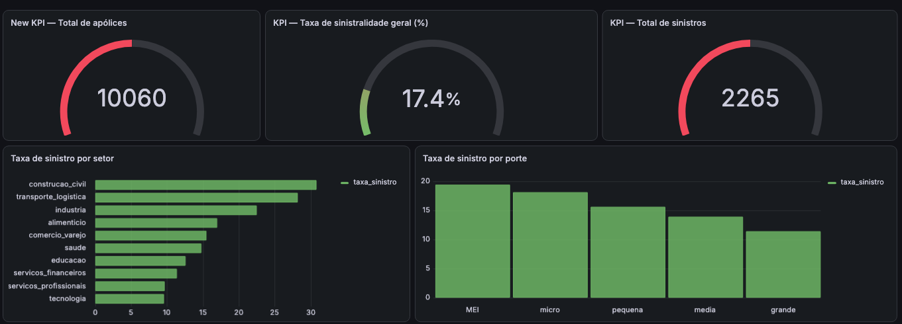
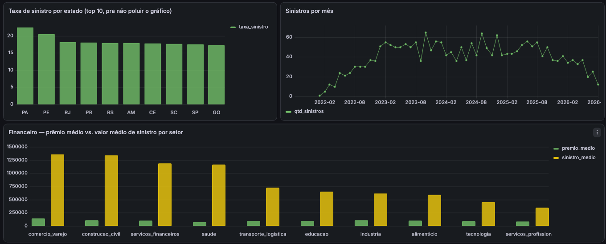
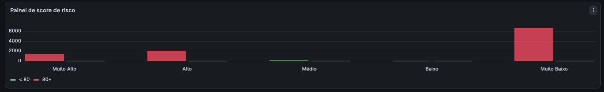

# Modelo de Risco de Sinistralidade — Seguradora B2B

Projeto de portfólio que simula o ciclo completo de um caso de **risco de sinistralidade em uma seguradora B2B** (que atende exclusivamente empresas): geração de dados sintéticos, modelagem de banco, engenharia de atributos, modelo preditivo de propensão a sinistro e dashboard de acompanhamento.

> ⚠️ **Aviso sobre os dados**: por não existir um dataset público adequado de sinistralidade B2B, todos os dados usados neste projeto são **sintéticos**, gerados via script Python (`etl/gerar_dados_sinteticos.py`) com distribuições e regras plausíveis para o setor de seguros. Nenhuma informação real de empresas ou sinistros foi utilizada.

---

## Objetivo

Simular o fluxo de um time de dados em uma seguradora B2B ao construir um modelo de **propensão a sinistro** — ou seja, dado o perfil de uma empresa e sua apólice, qual a probabilidade dela registrar um sinistro no período de vigência. O projeto cobre desde a geração da base até um dashboard de acompanhamento de carteira.

---

## Stack técnica

| Camada | Tecnologia |
|---|---|
| Geração de dados | Python (`numpy`, `pandas`, `Faker`) |
| Banco de dados | PostgreSQL 16 (via Docker) |
| Modelagem de dados | SQL (schema estrela: `dim_empresa`, `fato_apolice`, `fato_sinistro`) |
| EDA e feature engineering | Python (`pandas`, `matplotlib`, `seaborn`), Jupyter Notebook |
| Modelo preditivo | `scikit-learn` (Regressão Logística e Random Forest), `imbalanced-learn` (SMOTE) |
| Dashboard | Grafana (via Docker) |
| Orquestração local | Docker Compose |

---

## Arquitetura

```
gerar_dados_sinteticos.py
        │
        ▼
   CSVs (data/)
        │
        ▼
   PostgreSQL  ──▶  dim_empresa / fato_apolice / fato_sinistro
        │
        ▼
   Notebook EDA + Feature Engineering  ──▶  dataset_features.csv
        │
        ▼
   Notebook Modelo Preditivo  ──▶  modelo_sinistralidade_logreg.pkl
        │
        ▼
   gerar_scores.py  ──▶  tabela score_risco_empresa (Postgres)
        │
        ▼
   Grafana  ──▶  Dashboard de Sinistralidade
```

---

## Estrutura do projeto

```
insurance-risk-model/
├── data/                     # CSVs gerados (não versionados)
├── dashboard/                # Screenshots do dashboard Grafana
├── etl/
│   ├── gerar_dados_sinteticos.py
│   └── gerar_scores.py
├── models/                   # Modelo treinado (.pkl) e scaler
├── notebooks/
│   ├── 02_eda_feature_engineering.ipynb
│   └── 03_modelo_preditivo.ipynb
├── sql/
│   ├── 01_schema.sql
│   └── 02_load_data.sql
├── docker-compose.yml
├── requirements.txt
└── README.md
```

---

## Modelagem de dados

Schema estrela simples, com uma dimensão de empresa e duas tabelas fato:

- **`dim_empresa`** — dados cadastrais e de perfil da empresa (setor, porte, tempo de mercado, estado, faturamento anual, número de funcionários)
- **`fato_apolice`** — apólices contratadas (cobertura, valor segurado, prêmio anual, franquia, vigência, e a flag alvo `teve_sinistro`)
- **`fato_sinistro`** — sinistros ocorridos, vinculados à apólice e à empresa

---

## Principais achados (EDA)

A análise exploratória revelou padrões consistentes de risco:

- **Setor**: construção civil e transporte/logística concentram as maiores taxas de sinistro (~28-30%), enquanto tecnologia e serviços profissionais ficam nas taxas mais baixas (~10-12%).
- **Porte**: relação inversa clara entre porte e sinistralidade — empresas MEI têm a maior taxa (~19%), caindo progressivamente até empresas de grande porte (~11%). Empresas menores tendem a ter processos de gestão de risco menos maduros.
- **Estado**: Pará e Pernambuco lideram entre os estados com maior volume de apólices (~20-22%), com o restante do top 10 concentrado numa faixa mais estreita (~17-18%).
- **Sazonalidade**: o volume de sinistros cresceu de forma consistente entre 2022 e 2024, com estabilização/leve queda a partir de 2025.
- **Financeiro**: o valor médio de sinistro supera com folga o prêmio médio anual em praticamente todos os setores — esperado, já que o prêmio é precificado para cobrir o risco agregado da carteira, não o custo de um sinistro individual.

---

## Modelo preditivo

Testados dois modelos de classificação binária para prever `teve_sinistro`, com tratamento de desbalanceamento via **SMOTE** aplicado apenas ao conjunto de treino:

| Modelo | AUC-ROC |
|---|---|
| **Regressão Logística** | **0.917** |
| Random Forest | 0.894 |

**Modelo escolhido: Regressão Logística.** Além do melhor desempenho, é mais interpretável — os coeficientes explicam diretamente a direção e magnitude do efeito de cada variável na propensão a sinistro, o que é valioso para justificar decisões de subscrição para um stakeholder de negócio. O resultado também é coerente com a natureza dos dados sintéticos, gerados a partir de regras majoritariamente lineares/aditivas.

O modelo final foi usado para gerar um **score de risco** (probabilidade de sinistro) por apólice/empresa, classificado em 5 faixas:

| Faixa | Empresas | Score médio |
|---|---|---|
| Muito Alto | 1.331 | 0.979 |
| Alto | 2.036 | 0.665 |
| Médio | 73 | 0.563 |
| Baixo | 2 | 0.387 |
| Muito Baixo | 6.618 | 0.096 |

A forte concentração nos extremos (Muito Baixo e Muito Alto/Alto) indica que o modelo separa bem as classes, com pouca ambiguidade na zona intermediária — coerente com o AUC obtido.

---

## Dashboard

Dashboard construído no Grafana, conectado diretamente ao PostgreSQL, com atualização em tempo real conforme o banco é alimentado.

**KPIs gerais, sinistralidade por setor e por porte:**



**Sinistralidade por estado, evolução mensal e análise financeira:**



**Distribuição da carteira por faixa de score de risco:**



---

## Como rodar o projeto

**1. Subir a infraestrutura (Postgres + Grafana):**
```bash
docker compose up -d
```

**2. Criar o ambiente Python e instalar dependências:**
```bash
python3 -m venv venv
source venv/bin/activate
pip install -r requirements.txt
```

**3. Gerar os dados sintéticos:**
```bash
python etl/gerar_dados_sinteticos.py
```

**4. Criar o schema e carregar os dados no Postgres:**
```bash
psql -h localhost -p 5432 -U postgres -d risco_sinistralidade_dw -f sql/01_schema.sql
psql -h localhost -p 5432 -U postgres -d risco_sinistralidade_dw -f sql/02_load_data.sql
```

**5. Rodar os notebooks** (`notebooks/02_eda_feature_engineering.ipynb` e `notebooks/03_modelo_preditivo.ipynb`) em sequência, via Jupyter ou VS Code.

**6. Gerar os scores de risco e gravá-los no banco:**
```bash
python etl/gerar_scores.py
```

**7. Acessar o Grafana** em `http://localhost:3000` (usuário/senha padrão: `admin`/`admin`), configurar o data source PostgreSQL apontando para `risco_sinistralidade_db:5432` / banco `risco_sinistralidade_dw`, e importar/recriar o dashboard.

---

## Autor

**Leandro Fernandes**
Senior BI Analyst & Data Engineer
[lfernandesinsight.github.io](https://lfernandesinsight.github.io)
